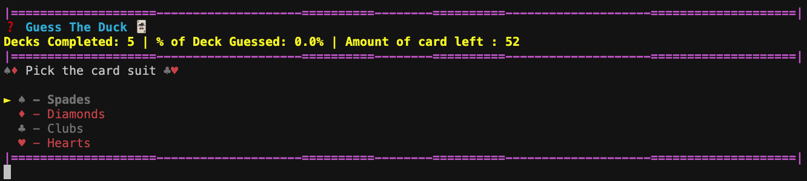
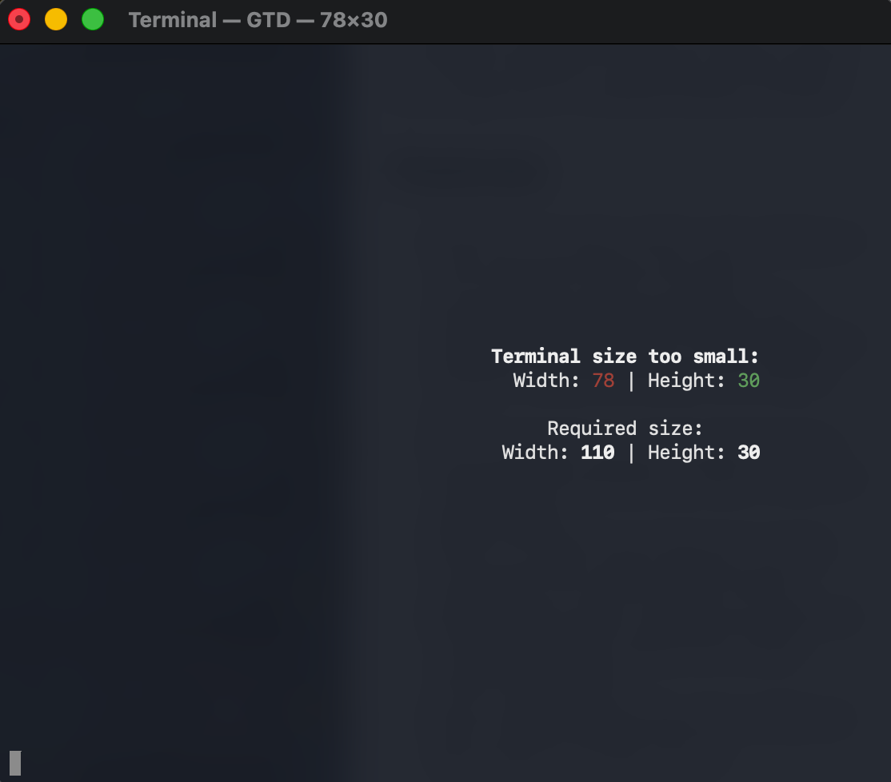

# Guess The Duck

This project is called Guess the Duck, which is a CLI Python card game where you need to guess every single card in a regular playing card deck.

## Features

- Save File: A function where, when exiting out of the terminal window, the game automatically saves the progress of the game (Decks Completed, Correct Guesses in the Deck, Cards Removed from the Deck, etc.)
- CLI: The game runs on the Command Line Interface which presents an easy to use, and global platform.
- Command Line Interface Size Warning: Custom function that makes sure the terminal size is wider than 100 and taller than 30
- ASCII: This game uses ASCII art to create the image of the cards and title screen.
- ANSI escape codes: The game includes and uses ANSI escape codes which create colour and boldness
- Pypi: This game uses Pypi which makes the game easier to access and run.

## Images







## How to Access/Play

Requirements:

- MacOS or Linux device
- Python 3.9 or later (the latest to be safe)
- Pip 22 or later (the latest to be safe)

1. You'll need to have Python and pip installed. 
    - You can follow [this](https://www.python.org/downloads/) to install Python
    - You can follow [this](https://pypi.org/project/pip/) to install pip

2. In the terminal, enter the command:

    ```sh
    pip install guess-the-duck
    ```

    This will install the game so that it's easy to run and access.

3. Once installed, you can use the commands: `GTD`, `guess-the-duck`, `playguess-the-duck`, `playGTD` and `play-GTD` to run the game.

4. Have fun and good luck.

## How the Game Works

The aim of the game is to guess every single card in a regular playing card deck.

1. When entering into the game you will encounter a title screen. When any key is pressed, you'll be given options for a suit, this will represent the suit of the card you will pick.

2. After choosing the suit, you will be given the option to pick the card value of the card you are guessing.

3. Then, once confirming the card, the game will (after shuffling the deck) draw the top card of the deck. This is the card that has to match your card. There will be 2 outcomes.
    1. If the card you guessed is not the same as the card on the top of the deck, the drawn card will be placed on the bottom of the deck and you will proceed to guess again
    2. If the card you guessed is the same as the card on the top of the deck, the drawn card will be removed from the deck as well as the option to pick that card. The stats will also increase showing you how many cards you have successfully guessed from the deck.
4. When successfully guessing the card, 2 things will also happen.
    1. If there are still cards in the deck, you will have to keep guessing cards.
    2. If there are no more cards in the deck, you've successfully guessed an entire deck of playing cards. Your win counter will increase and you will be given the option to press any key to start another deck.
5. Rinse and repeat.

## Notes

This game is extremely challenging and compared to my past games, it's really difficult to guess even one entire deck.

This game is called Guess The Duck, but by now you can probably tell that it's not guessing ducks but guessing cards.
