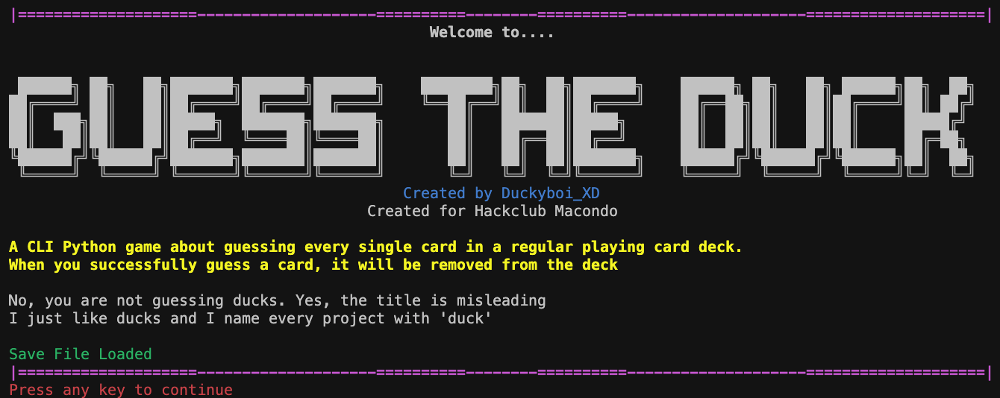
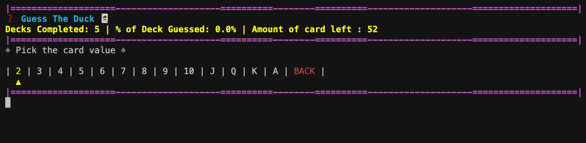
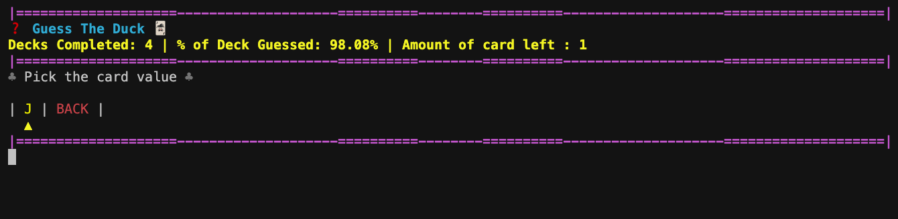
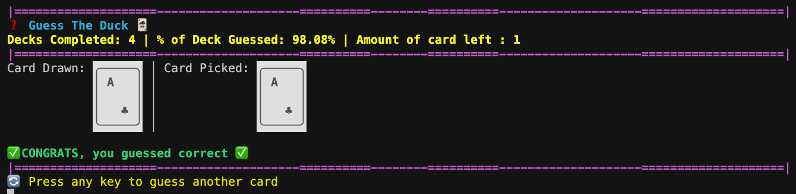

# Guess The Duck

This project is called Guess the Duck, which is a CLI Python card game where you need to guess every single card in the regular playing card deck.

## Features

- Save File: A funtion where when exiting out of the terminal window, the game automatically saves the progress of the game (Deck's Completed, Correct Guesses in th Deck, Cards Removed from the Deck, etc)
- CLI: The game runs on the Command Line Interface which presents a easy to use, and global platform.
- ASCII: This game uses ASCII art to create the image of the cards and title screen.
- ANSI escape codes: The game includes and uses ANSI escape codes which creates colour and bokldness
- Pypi: This game uses Pypi which makes the game easier to access and run.

## Images

